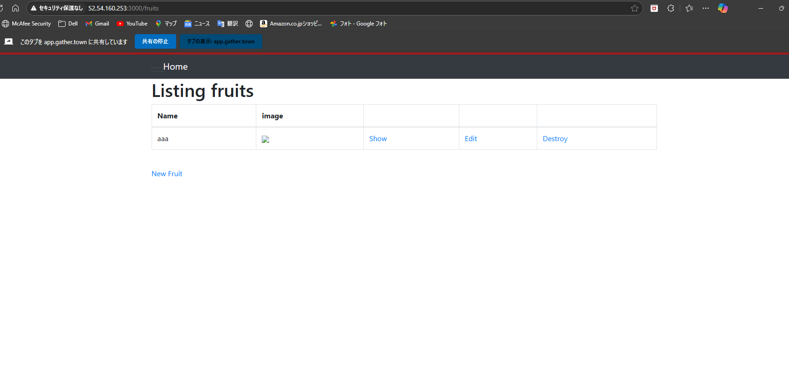
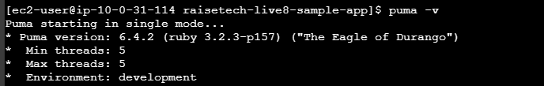
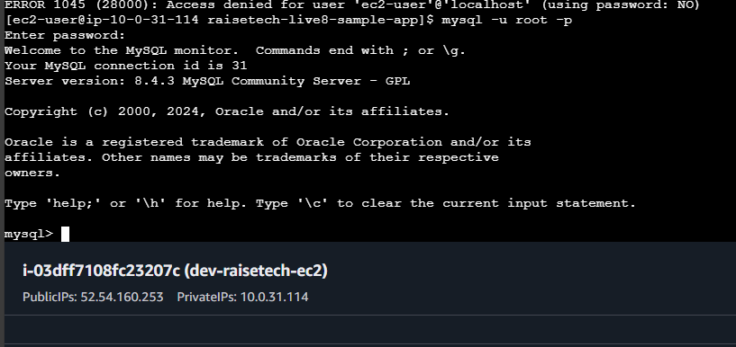

# 第3回課題
githubのリポジトリの内容  
(RaiseTechが用意したもの)をEC２を使ってデプロイする作業を行った。
* サンプルアプリをwebブラウザから開いた画面　
)
## APサーバについて調べる
* APサーバの名前とバージョン→puma6.4.2　
* 終了後、アクセスできない　
## DBサーバについて調べる
* DBサーバの名前とバージョン→mysql8.4.3 
* 終了後、アクセスできるがエラー　
## railsの構成管理ツールの名前
* bundler
## 課題から学んだこと、感じたこと
* わからないことが多すぎて何度やってもうまくいかず、諦めかけた。でも諦めずに粘り強くわからないことは調べながら取り組み、gatherにいた先輩に聞いたりして、ついにブラウザから表示された画面を見たときは喜びのあまり声を上げた。今後も少しずつでいいから課題を進めていくうえでAWSの理解を深めていきたい。
