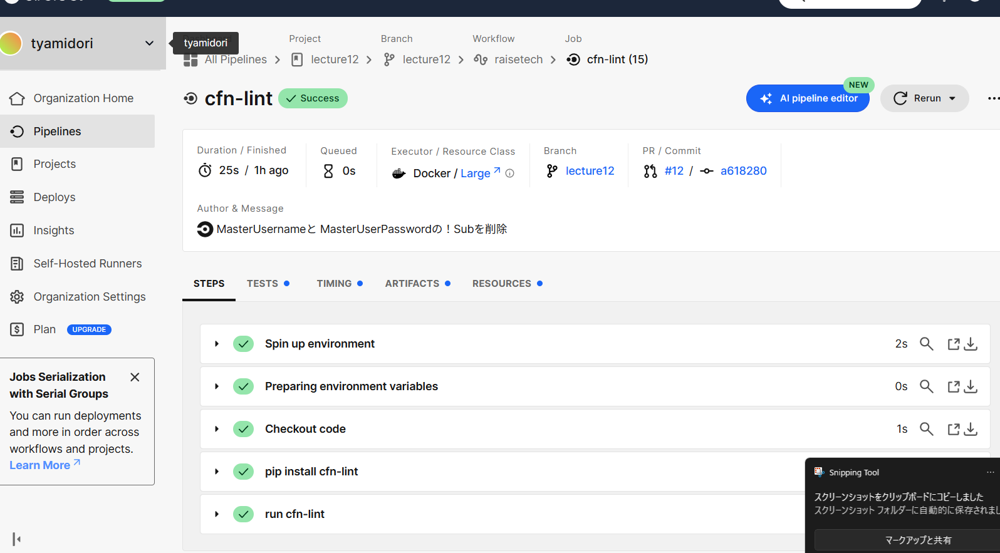

# 第12回課題
## 概要
今回の課題では、CI/CDの練習として、課題の提出に用いているこのリポジトリにcircleCIを導入し、cloudformationのディレクトリの中のymlファイルの中身がちゃんと動作するか不備がないかのテストを行った。
## circleCIで実行されたファイル
* [config.yml](config.yml)
## 実行された結果

## 感想
* 構文のエラーだけでなく、セキュリティ面でここはこうしたほうが良いよというのを教えてくれるのでより安心安全なインフラ構築ができると思った。
* 何度もエラーがなくならなくて心が折れかけたが、chatGPTに状況を逐一伝えたら解決できたのでありがたかった。