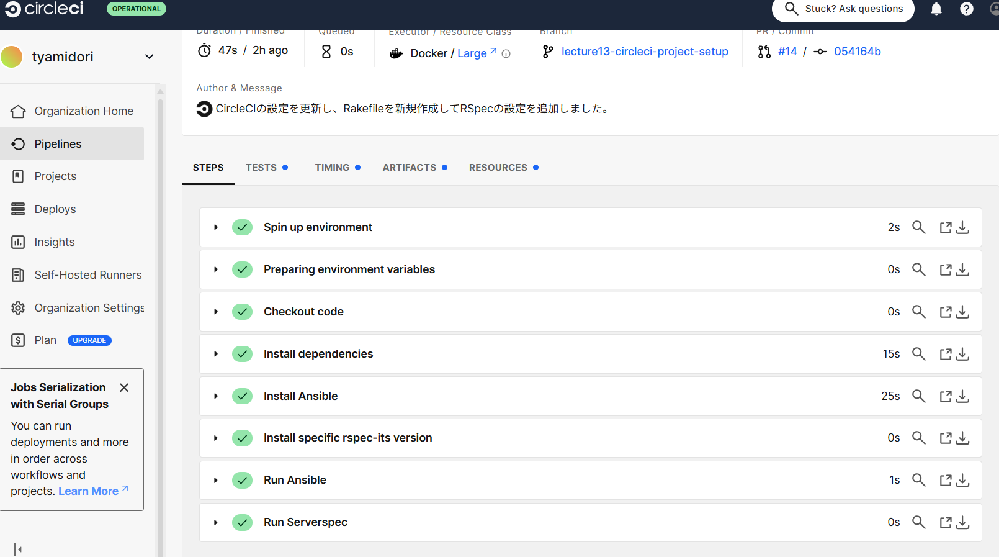

# 第13回課題
## 概要
 第12回で使用したCircleCIのサンプルに 、ServerSpecやAnsible の処理を追加し、実行。その結果を提出。
## 使用したファイル
* [circleciのファイル(config.yml)](config.yml)→プロジェクトで「いつ、どんなテスト・ビルド・デプロイを行うか」を、YAML形式で定義する設定ファイル
* [ansibleのファイル１(inventory.ini)](inventory.ini)
→どのサーバーに対して、どのように接続して処理を行うか。
* [ansibleのファイル２(test.yml)](test.yml)→ansibleで行うテストの内容（localhost（自分のPC）に対して、Ansible の ping モジュールで接続確認）
* [serverspecのファイル１(sample_spec.rb)](sample_spec.rb)→serverspecで行うテストの内容（ファイルに”hello”を出力して、そのファイルが実行されたときに”hello”がちゃんと表示されるか）
* [serverspecのファイル２(Rakefile)](Rakefile)→rakeコマンドを使って、記述された作業を実行するためのファイル
## 実行した結果
* circleciの実行結果サクセス

* circleciのテスト項目

## 感想
※第１３回課題と関係ない操作をうっかり忘れていてこのブランチで行ってしまいました...。
* 今回ssh接続無しで最小単位でci/cdを行いました。ハードルを低くして行いましたが、何となくの一通りの流れは掴むことができ、自身がつきました。
